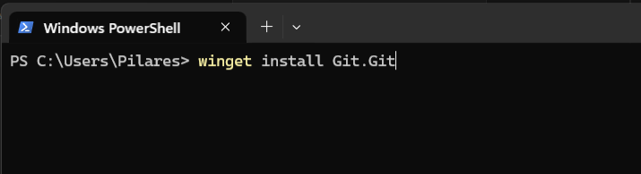
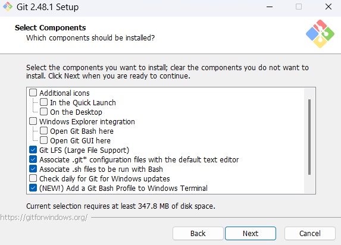

Aquí tienes un tutorial estructurado con las imágenes integradas:

---

# Tutorial: Instalación de Git en Windows

### **Requisitos**
- Sistema operativo Windows 7 o superior
- Conexión a internet
- Permisos de administrador (opcional, recomendado)

---

## **Método 1: Instalación mediante PowerShell**
1. Abre **PowerShell** como administrador:  
     
   Ejecuta el comando:  
   ```powershell
   winget install --id Git.Git -e --source winget
   ```

---

## **Método 2: Instalación desde la página oficial**
### Paso 1: Descarga el instalador
1. Visita [git-scm.com](https://git-scm.com/)  
     
2. Selecciona la versión para Windows (64-bit recomendado):  
   

---

### Paso 2: Ejecuta el instalador
1. Haz doble clic en el archivo descargado (**.exe**):  
   

---

### Paso 3: Configuración inicial
1. Acepta los términos de licencia:  
     
2. Selecciona componentes (marca todo para integración completa):  
     
3. Elige el manejador de credenciales (**Git Credential Manager Core** recomendado):  
     

---

### Paso 4: Personalización avanzada
1. **Configuración de línea de comandos**:  
   - Selecciona _"Git from the command line and also from 3rd-party software"_:  
     

2. **Editor predeterminado**:  
   - Recomendado: **Visual Studio Code** o **Nano** (evita Vim si no tienes experiencia):  
     

3. **Nombre de rama principal**:  
   - Usa **main** (estándar moderno):  
     

4. **Configuración SSH**:  
   - Mantén la opción predeterminada:  
     

---

### Paso 5: Finalizar instalación
1. Confirma todas las opciones y haz clic en **Install**:  
     
2. Espera a que finalice el proceso:  
 

---

## **Verificación de la instalación**
1. Abre **Git Bash** desde el menú de inicio.

    

2. Ejecuta:  
   ```bash
   git --version
   ```  
   Deberías ver algo como: `git version 2.48.1.windows.1`

    


---

## **Configuración inicial recomendada**
1. Establece tu identidad:  
   ```bash
   git config --global user.name "Tu Nombre"
   git config --global user.email "tu@email.com"
   ```
    
---


> **Nota**: Todas las imágenes son referenciales. Asegúrate de seguir las opciones que mejor se adapten a tu flujo de trabajo.


Aquí tienes el tutorial paso a paso con integración de imágenes:

---

# Crear tu Primer Repositorio Git

### **Requisitos previos**
- Git instalado en tu sistema (ver tutorial anterior)
- Terminal/Git Bash abierta

---

## **Paso 1: Navegar a la carpeta de trabajo**
1. Ejecuta en la terminal:  
   ```bash
   cd "yuuta SW/SW_02/"
   ```  
   💡 *Si hay espacios en las rutas, usa comillas o escapes (ej: `cd yuuta\ SW/SW_02/`)*  
   

---

## **Paso 2: Inicializar el repositorio**
1. Crea un repositorio Git vacío:  
   ```bash
   git init
   ```  
   ✅ *Verás: `Initialized empty Git repository in [ruta]/.git/`*

---

## **Paso 3: Crear archivo inicial**
1. Genera un archivo HTML con contenido básico:  
   ```bash
   echo "Hola el pepe" > index.html
   ```  
   🔍 *Usa `ls` para confirmar que el archivo se creó*.

---

## **Paso 4: Verificar estado del repositorio**
1. Revisa los cambios pendientes:  
   ```bash
   git status -s
   ```  
   🟥 *Verás `?? index.html` (archivo nuevo no rastreado)*.

---

## **Paso 5: Preparar archivos para commit (staging)**
1. Añade todos los archivos al área de staging:  
   ```bash
   git add .
   ```  
   🔄 *Usa `git reset HEAD <archivo>` si necesitas deshacer cambios*.

---

## **Paso 6: Guardar cambios con commit**
1. Crea un commit con fecha descriptiva:  
   ```bash
   git commit -am "1 de marzo 2025"
   ```  
   📝 *El flag `-a` incluye automáticamente cambios en archivos rastreados*.

---

## **Resultado Final**
  


---

## **Flujo de Trabajo Básico**
1. Modifica archivos → `git add` → `git commit`  
2. Repite para cada nueva funcionalidad/corrección  
3. Usa `git push` para subir cambios a plataformas como GitHub/GitLab (requiere configuración adicional).

--- 

✅ **¡Felicidades!** Has creado tu primer repositorio Git.  
🚀 **Siguiente paso**: Conectar el repositorio local a un servicio en la nube (ej: GitHub).


