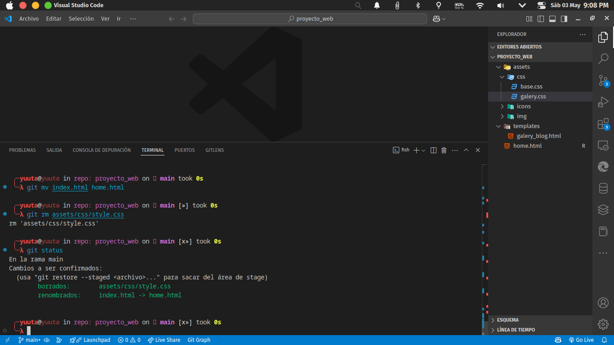

1. crear una cuenta de github

    

2. descargar proyecto
    

3. crear repositorio local
    


Actividad 1

1. Cambiar el nombre de un archivo

cambiamos el nombre del archivo index.html a home.html.

- Ejecuta el comando `git mv` para cambiar el nombre del archivo:

    ```bash
    git mv index.html home.html
    ```
    Esto cambiará el nombre del archivo en el sistema de archivos y preparará el cambio para la próxima confirmación.

    
    


- Confirma el cambio en el repositorio:
    ```bash
    git commit -m "Renombrar index.html a home.html"
    ```

2. Eliminar un archivo

eliminamos el archivo style.css.

- Ejecutamos el comando `git rm` para eliminar el archivo:

    ```bash
    git rm assets/css/style.css
    ```

    Esto eliminará el archivo del sistema de archivos y añadirá el evento de eliminación al índice.

    

- Confirma la eliminación en el repositorio:

    ```bash
    git commit -m "Eliminar archivo style.css"
    ```

3. Confirmar cambios múltiples (opcional)
Si realizas varios cambios (renombrar y eliminar archivos), puedes confirmarlos todos en un solo paso:

- Asegúrate de que todos los cambios están listos:
    ```bash
    git status
    ```

    

- Confirma todos los cambios:

    ```bash
    git commit -m "Renombrar y eliminar archivos según la actividad"
    ```

    

4. Verifica los cambios
Para verificar que los cambios se han aplicado correctamente, usa:

    ```bash
    git log --oneline
    ```

    Esto mostrará un historial de confirmaciones, incluyendo los cambios realizados.

    


Actividad 2

1. Cambiar el nombre de un archivo fuera de Git

    Usando un IDE (como Visual Studio Code):

    - Abre el archivo en el explorador de archivos del IDE.
    - Haz clic derecho sobre el archivo que deseas renombrar (por ejemplo, `galery_blog.html`).
    - Selecciona la opción **Renombrar** y cambia el nombre (por ejemplo, a `gallery_blog.html`).
    - Guarda los cambios.
    
    

    **Usando Bash:**
    - Usa el comando `mv` para renombrar el archivo:

        ```bash
        mv templates/galery_blog.html templates/gallery_blog.html
        ```
        
2. Eliminar un archivo fuera de Git

    **Usando Bash:**

    - Para eliminar un archivo no rastreado por Git (por ejemplo, galery.css), usa:

        ```bash
        git clean -f
        ```

        Esto eliminará los archivos no rastreados del directorio de trabajo.

        

    - Si también deseas eliminar subdirectorios vacíos, usa:

        ```bash
        git clean -f -d
        ```

        

3. Cambiar el nombre de un archivo en Git


    - Usa el comando `git mv` para renombrar un archivo rastreado por Git:

        ```bash
        git mv templates/galery_blog.html templates/gallery_blog.html
        ```

        Esto actualizará el índice de Git con el nuevo nombre.

        
    - Confirma el cambio:

        ```bash
        git commit -m "Renombrar galery_blog.html a gallery_blog.html"
        ```
        
        

4. Eliminar un archivo de Git

    - Usa el comando git rm para eliminar un archivo rastreado por Git (por ejemplo, galery.css):

        ```bash
        git rm assets/css/galery.css
        ```

        

    - Confirma la eliminación:

        ```bash
        git commit -m "Eliminar archivo galery.css"
        ```

        

        

5. Verificar los cambios

    - Usa git status para verificar los cambios pendientes:

        ```bash
        git status
        ```

    - Usa git log para confirmar los cambios realizados:

        ```Bash
        git log --oneline
        ```
        
