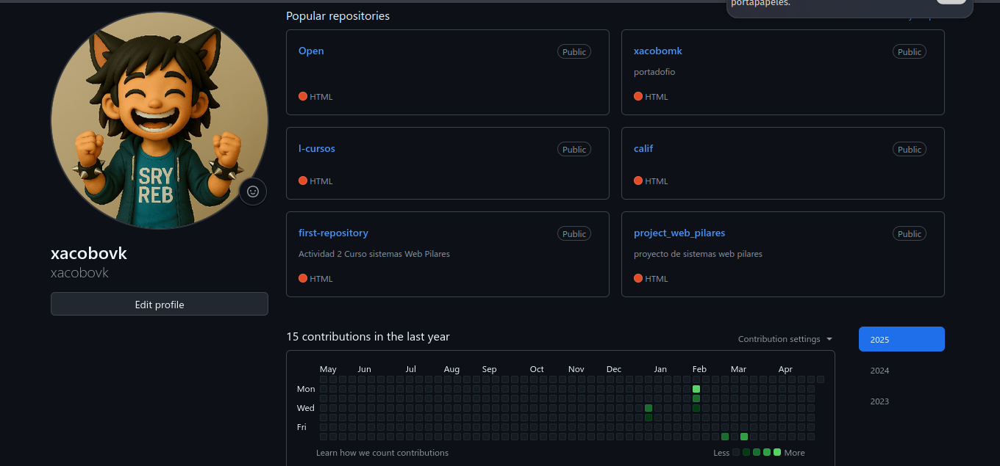
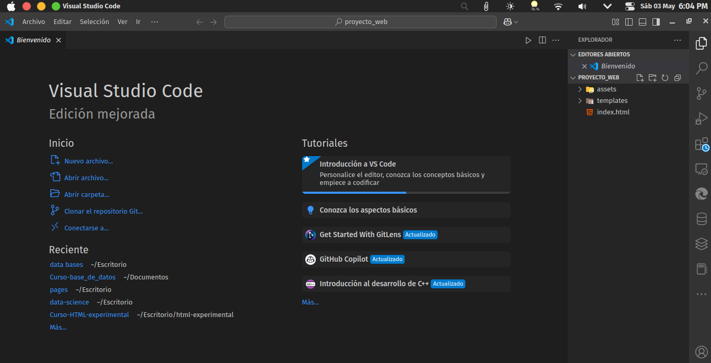
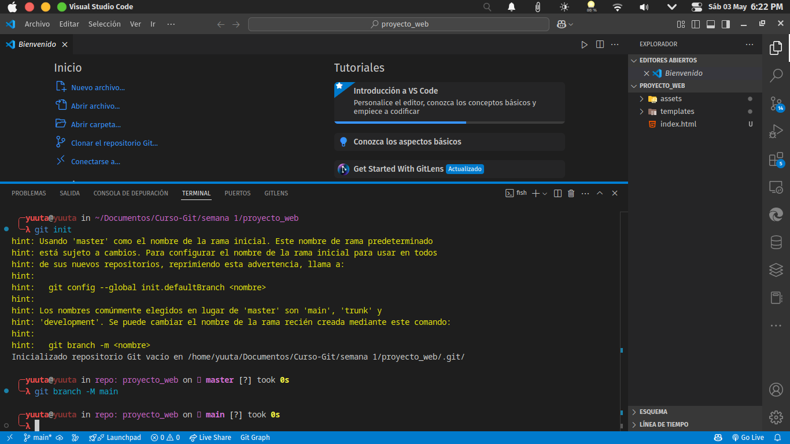
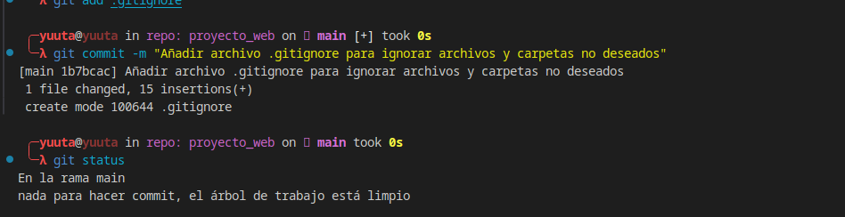

1. crear una cuenta de github

    

2. descargar proyecto
    

3. crear repositorio local
    


4. **Crear el archivo `.gitignore`**

- Abre una terminal o visual studio code en la raíz de tu proyecto:

- Crea o abre el archivo .gitignore:

    **Desde la terminal**

    ```bash
    nano .gitignore
    ```

    

- Escribe los nombres de los archivos o carpetas que deseas ignorar, uno por línea. Por ejemplo:

    ```bash
    # Ignorar archivos temporales
    *.tmp
    *.log

    # Ignorar carpetas específicas
    /node_modules/
    /dist/

    # Ignorar imágenes y archivos de iconos
    assets/img/
    assets/icons/

    # Ignorar archivos del sistema
    .DS_Store
    Thumbs.db
    ```

    

- Guarda el archivo y cierra el editor (en `nano`, presiona `CTRL+O`, luego `Enter`, y finalmente `CTRL+X`).

5. **Confirmar el archivo `.gitignore` en el repositorio**

- Añade el archivo `.gitignore` al área de preparación:

    ```bash
    git add .gitignore
    ```

    
- Realiza una confirmación:

    ```bash
    git commit -m "Añadir archivo .gitignore para ignorar archivos y carpetas no deseados"
    ```

    

6. **Verificar que los archivos ignorados no se rastrean**

- Usa el comando git status para verificar que los archivos o carpetas especificados en .gitignore no aparecen en el área de preparación:

    ```bash
    git status
    ```

    


